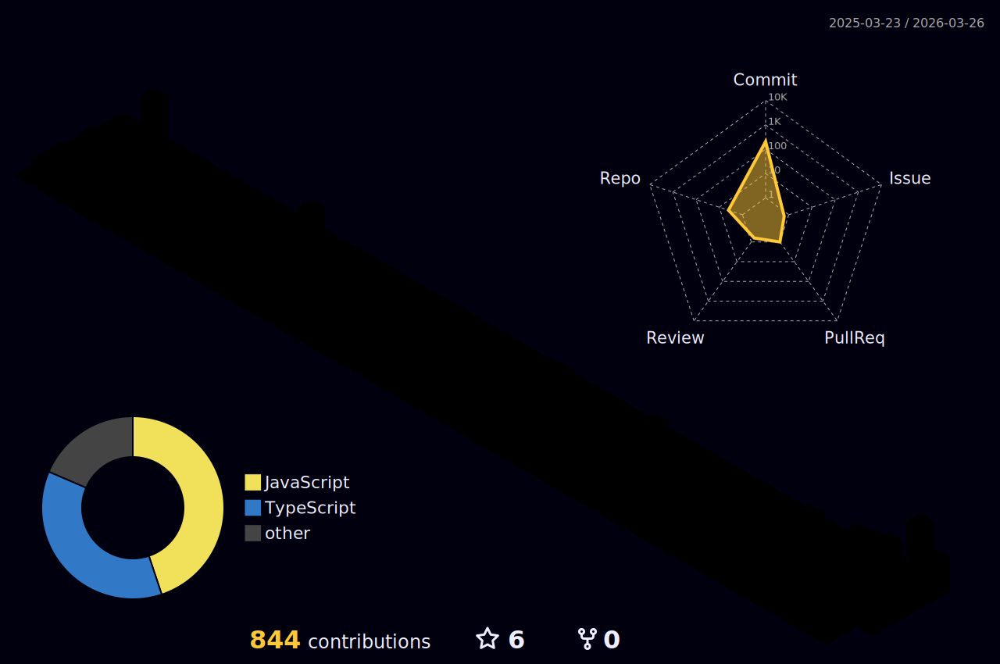

  
   
  

 

  Please to meet you! I'm a **Computer Science Student** & **Developer** from Turkey 🇹🇷.  
  Focusing on **NLP**, **Computer Vision** and **Scalable Backend Systems**.

  ---
  
  Currently working on 🔭 **Advanced AI Models** Learning 🌱 **Cloud Architecture & Microservices** Ask me about 💬 **Python, Java, & Deep Learning**

 

  

 

<h3 align="center">🛠️ Tech Stack & Arsenal</h3>

  
   
  

 

<h3 align="center">⚡ GitHub Analytics</h3>

  
  

<h3 align="center">🌍 3D Contribution City</h3>

  

  

 

  
  
  

   
  

